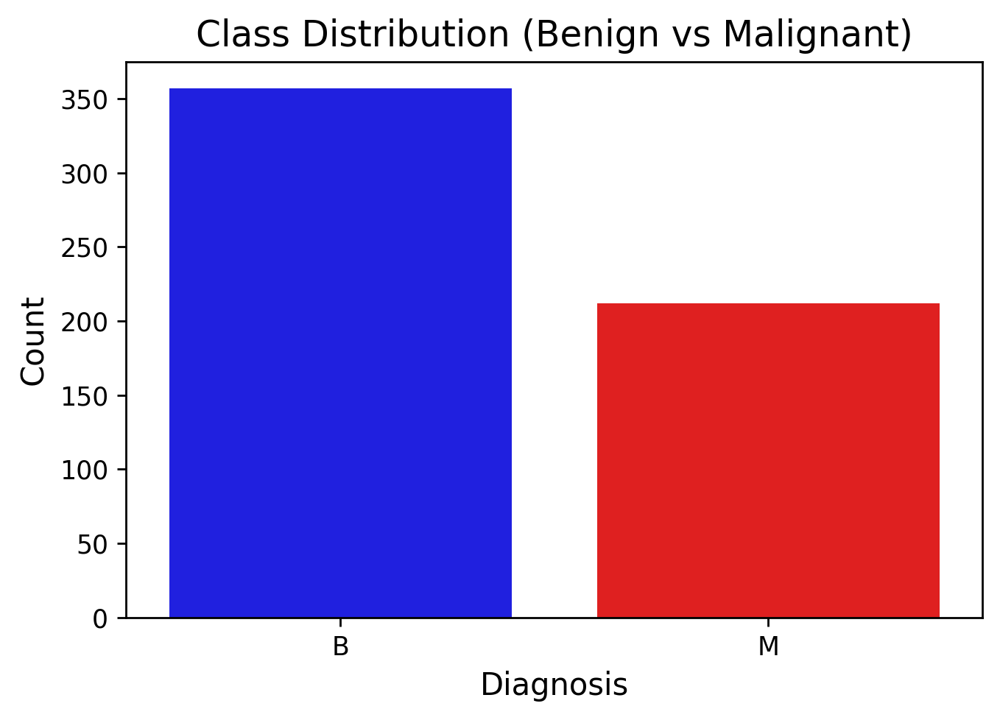
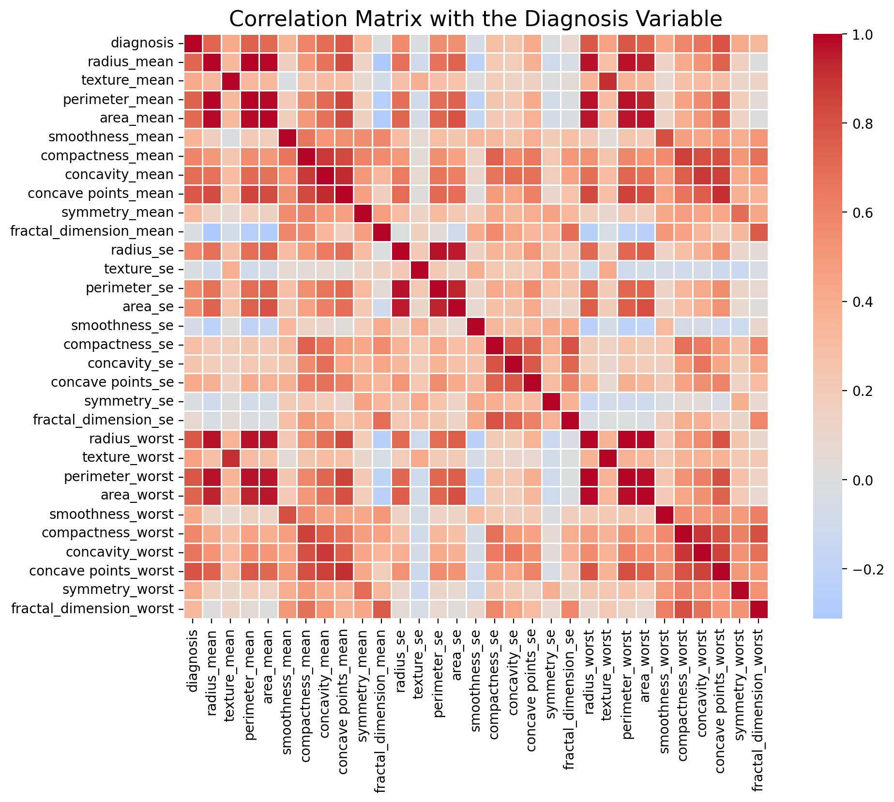
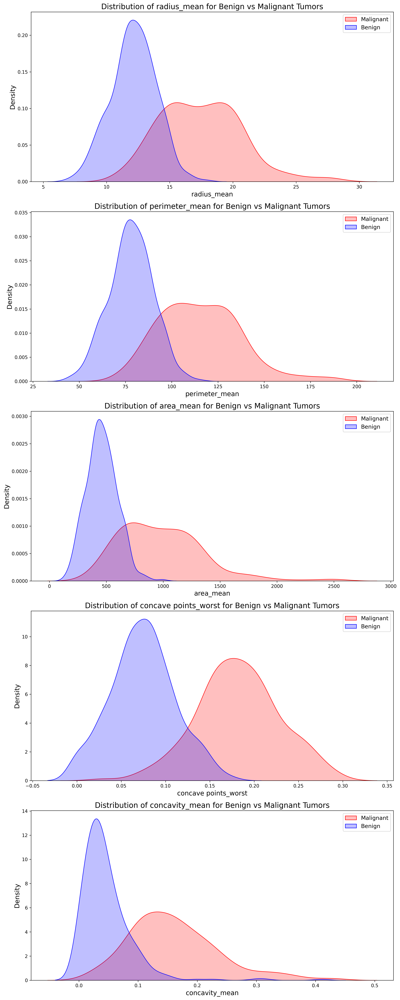
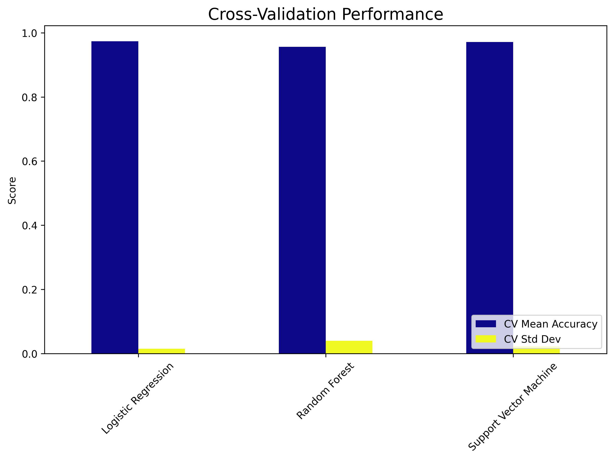
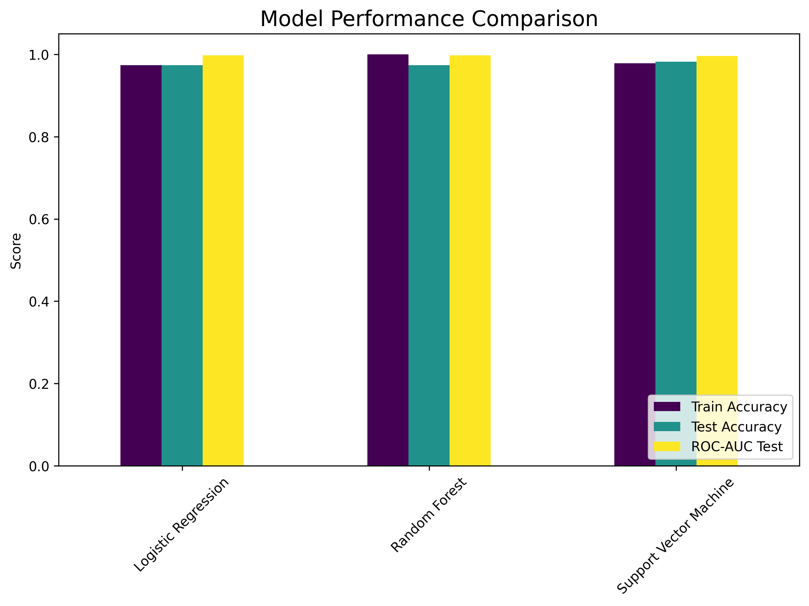

# Breast Cancer Classification Using Machine Learning

This project uses machine learning to classify breast cancer as benign or malignant. It applies Scikit-learn, Pandas, and Matplotlib for analysis. The workflow includes data preprocessing, exploratory data analysis (EDA), model training, and evaluation.

---

## Project Overview

Breast cancer is a common disease. Early detection improves survival rates. This project builds a predictive model to classify breast cancer cases based on diagnostic features.

---

## Dataset

- **Source:** [UCI Machine Learning Repository](https://archive.ics.uci.edu/ml/datasets/Breast+Cancer+Wisconsin+\(Diagnostic\))


### Features:

- **Diagnosis:** Target variable (Benign/Malignant)
- **Cell nucleus properties:** Mean radius, texture, perimeter, area, smoothness
- **Tumor structure metrics:** Compactness, concavity, symmetry, fractal dimension
- **Statistical measurements:** Mean, standard error, worst values

---

## Data Exploration & Preprocessing

- Checked class distribution
- Visualised feature distributions
- Examined correlations with diagnosis
- Normalised numerical features
- Split dataset into **80% training** and **20% testing**

---

## Visualisations

### Class Distribution

The dataset is **balanced**, with 357 benign cases and 212 malignant cases.

### Correlation Matrix


The top correlated features with the diagnosis are:

- **Concave points\_worst (0.79)**
- **Perimeter\_worst (0.78)**
- **Concave points\_mean (0.77)**
- **Radius\_worst (0.77)**
- **Perimeter\_mean (0.74)**
- **Area\_worst (0.73)**
- **Radius\_mean (0.73)**
- **Area\_mean (0.71)**
- **Concavity\_mean (0.69)**

### Feature Distributions

Distinct separation is observed in some features between benign and malignant cases.

---

## Model Selection & Evaluation

### Models Used:

- **Logistic Regression**
- **Random Forest**
- **Support Vector Machine (SVM)**

### Cross-Validation Performance

| Model                  | CV Mean Accuracy | CV Std Dev |
| ---------------------- | ---------------- | ---------- |
| Logistic Regression    | 0.9736           | 0.0149     |
| Random Forest          | 0.9560           | 0.0399     |
| Support Vector Machine | 0.9714           | 0.0226     |



### Model Performance Comparison

| Model                  | Train Accuracy | Test Accuracy | ROC-AUC Test |
| ---------------------- | -------------- | ------------- | ------------ |
| Logistic Regression    | 0.9736         | 0.9737        | 0.9973       |
| Random Forest          | 1.0000         | 0.9737        | 0.9972       |
| Support Vector Machine | 0.9780         | 0.9825        | 0.9963       |



### Classification Reports

#### Logistic Regression:

```
Accuracy: 97.37%
Precision: 0.97 (Benign), 0.98 (Malignant)
Recall: 0.99 (Benign), 0.95 (Malignant)
F1-score: 0.98 (Benign), 0.96 (Malignant)
```

#### Random Forest:

```
Accuracy: 97.37%
Precision: 0.96 (Benign), 1.00 (Malignant)
Recall: 1.00 (Benign), 0.93 (Malignant)
F1-score: 0.98 (Benign), 0.96 (Malignant)
```

#### Support Vector Machine:

```
Accuracy: 98.25%
Precision: 0.97 (Benign), 1.00 (Malignant)
Recall: 1.00 (Benign), 0.95 (Malignant)
F1-score: 0.99 (Benign), 0.98 (Malignant)
```

---

## Results

- **SVM achieved 98.25% accuracy**
- **Top 5 important features identified**


---

## Key Insights

- **Concavity and area strongly predict malignancy**
- **Balanced class weights improved fairness**
- **SVM with RBF kernel performed best**
- **Early detection improves patient outcomes**

---